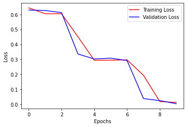
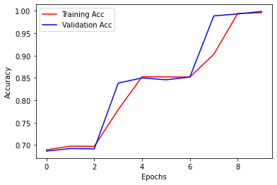

# Puyo Color Classification Using a Neural Network

## Why Neural Networks?
In my [original program](https://github.com/s2lsoftener/puyospectatorassist2), I classified the Puyo colors by taking the mean RGB value of the field cell. This worked pretty well, except it was only accurate for the Aqua skin. I don't think it handled occlusion or different color spaces very well, either. I figured with a neural network, I could account for all of that automatically.

After a lot of testing, the model I settled on was a multi-layer perceptron with 2 hidden layers (each with 50 nodes). Accuracy is better with convolutional layers, but I found that to cause a significant FPS penalty when used with [OpenCV's DNN module](https://docs.opencv.org/master/d2/d58/tutorial_table_of_content_dnn.html).

## Notebooks

* Dataset generation: [Dataset joblib.ipynb](Dataset%20joblib.ipynb)
* Model training: [MLP.ipynb](MLP.ipynb)

## PyTorch Model
```python
class PuyoClassifier(nn.Module):
    def __init__(self):
        super().__init__()
        self.fc = nn.Sequential(
            nn.Linear(2880, 50),
            nn.ReLU(),
            nn.Linear(50, 50),
            nn.ReLU(),
            nn.Linear(50, 7),
            nn.ReLU()
        )
    
    def forward(self, x):
        x = x.view(-1, 3 * 32 * 30)
        x = self.fc(x)
        return x
```
You can load the saved model weights from `puyo-classifier-aug10b.pt`. After training, the model was serialized to ONNX format in `puyo-mlp-gpu.onnx`.

## Loss and Accuracy
<div style="display: flex; flex-direction: row; justify-content: center;">


</div>

Is this overfitted...? Well, it seems to be decently accurate in [production](https://github.com/puyogg/puyo-chain-detector), so I guess it's fine.

## Sample Predictions, All Puyo Skins
