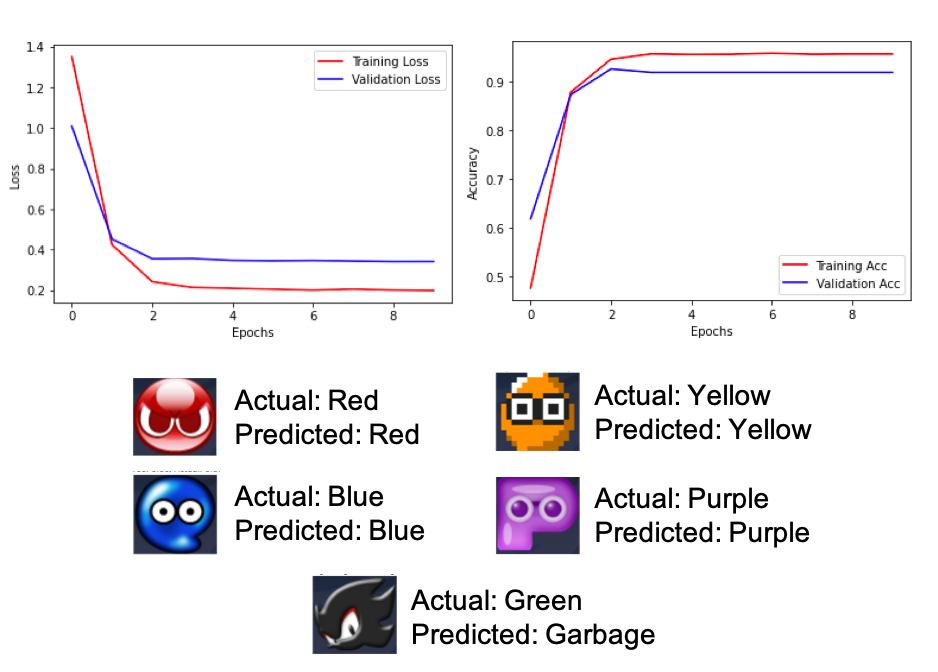
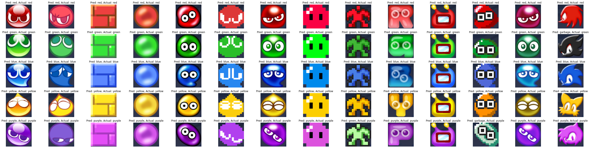

# Puyo Color Classification Using a CNN
<div style="display: flex; flex-direction: row; justify-content: center;">

</div>


## PyTorch Model
```python
class PuyoClassifier(nn.Module):
    def __init__(self):
        super().__init__()
        
        self.conv = nn.Sequential(
            nn.Conv2d(3, 16, kernel_size=3), # -> [-1, 16, 28, 30]
            nn.ReLU(),
            nn.AvgPool2d(2, 2), # -> [-1, 16, 14, 15]
            nn.Conv2d(16, 32, kernel_size=3), # -> [-1, 16, 12, 13]
            nn.ReLU(),
            nn.Conv2d(32, 10, kernel_size=3), # -> [-1, 10, 10, 11]
            nn.ReLU(),
        )

        self.fc = nn.Sequential(
            nn.Linear(10 * 10 * 11, 100),
            nn.ReLU(),
            nn.Dropout(0.4),
            nn.Linear(100, 32),
            nn.ReLU(),
            nn.Linear(32, 16),
            nn.ReLU(),
            nn.Linear(16, 6),
            nn.ReLU()
        )

    def forward(self, x):
        x = self.conv(x)
        x = x.view(-1, 10 * 10 * 11)
        x = self.fc(x)
        return x
```
You can load the saved model weights from `puyo-classifier.pt`.

## Results
<div style="display: flex; flex-direction: row; justify-content: center;">

</div>

The CNN makes the wrong prediction about the Purple Human Puyo, Purple MSX Puyo, and Shadow (he's supposed to replace a Green Puyo).

## Future Notes
* MSX, Degi, GameGear, and Human have different Red X's
* Need to boost Sonic, MSX, and Human colored Puyos to help purple/green get classified better.
